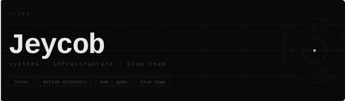

<!-- the observer. always watching. -->

 

infrastructure engineer building real enterprise environments on Linux.  
focused on system reliability, security hardening, and detection.

 

**lab**

| node | role |
|------|------|
| \`host\` | fedora 43 · kvm/qemu · virt-manager |
| \`dc01\` | windows server 2022 · ad ds · dns · gpo |
| \`client01\` | windows 10 enterprise · domain joined |
| \`kali\` | kali linux · penetration testing |
| \`rhel9\` | rhel 9 · sysadmin practice |
| \`wazuh\` | wazuh siem · log ingestion · alerting |
| \`pfsense\` | pfsense · suricata ids/ips |

 

**projects**

| repo | description |
|------|-------------|
| [windows-ad-homelab](https://github.com/JeycobSec/windows-ad-homelab) | enterprise active directory architecture and security controls |
| [c-port-scanner](https://github.com/JeycobSec/c-port-scanner) | tcp sweep utility · multithreaded · c |

 

linux · active directory · kvm · qemu · blue team

