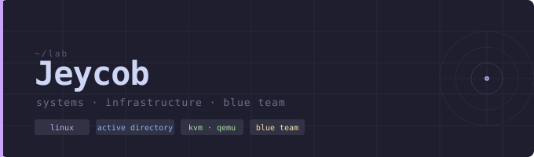

&nbsp;

> Infrastructure engineer building real enterprise environments on Linux.
> Focused on system reliability, security hardening, and detection.

&nbsp;

**lab**

| | |
|---|---|
| host | Fedora 43 · KVM/QEMU · virt-manager |
| dc01 | Windows Server 2022 · AD DS · DNS · GPO |
| client01 | Windows 10 Enterprise · domain joined |
| kali | Kali Linux · penetration testing |
| rhel9 | RHEL 9 · sysadmin practice |
| wazuh | Wazuh SIEM · log ingestion · alerting |
| pfsense | pfSense · Suricata IDS/IPS |

&nbsp;

**projects**

| | |
|---|---|
| [windows-ad-homelab](https://github.com/JeycobSec/windows-ad-homelab) | enterprise Active Directory architecture and security controls |
| c-port-scanner | multithreaded TCP enumeration in C++ |
| linux-infra-labs | system hardening and automation notes |

&nbsp;

**certifications**

&nbsp;

&nbsp;

*quiet systems · clean logs · steady signal*

